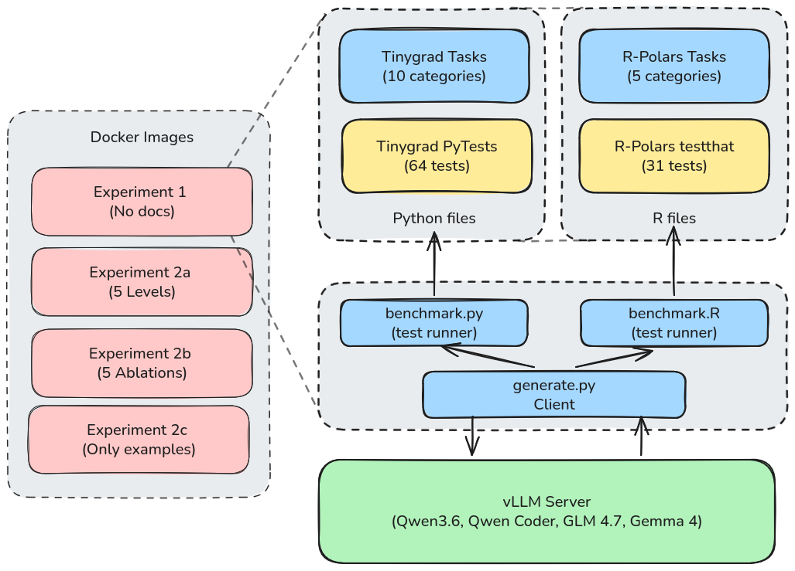

# LLM Evaluation Research for Omics

We are testing how LLMs perform given a variety of coding related workflows.
Work in progress, more tests will be added in the future.

This project evaluates how the amount and kind of API documentation given to an LLM
affects the code it writes. Each benchmark injects a configurable slice of a library's
docs into coding tasks, then scores the results to isolate documentation's effect — see
the individual sub-folders for setup and run instructions.

### LLM Coding Benchmark

Evaluates LLM coding ability using a mixture of popular and obscure python libraries.

Currently the test-suite include the following.

| Library  | Tests |    Details     |
|----------|-------|----------------|
| Tinygrad |   63  | Basic matrix operations to advanced function stacking and Neural Net architecture tests |
| R-Polars |   31  | Basic DataFrame ops through function chains to integrated multi-source lazy workflows |

